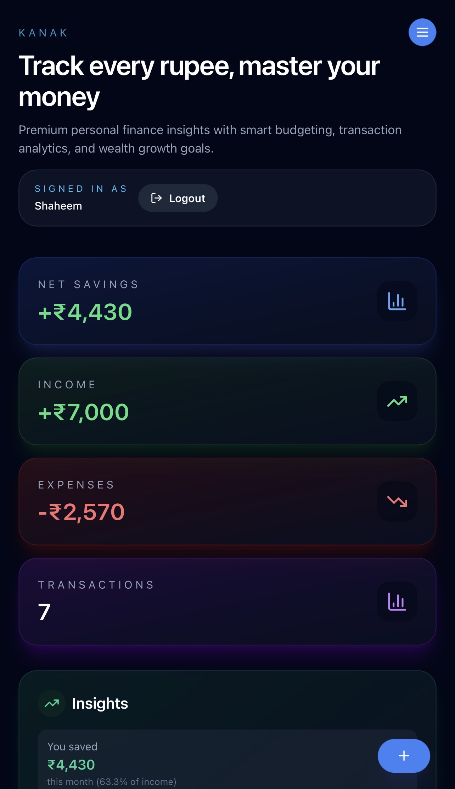
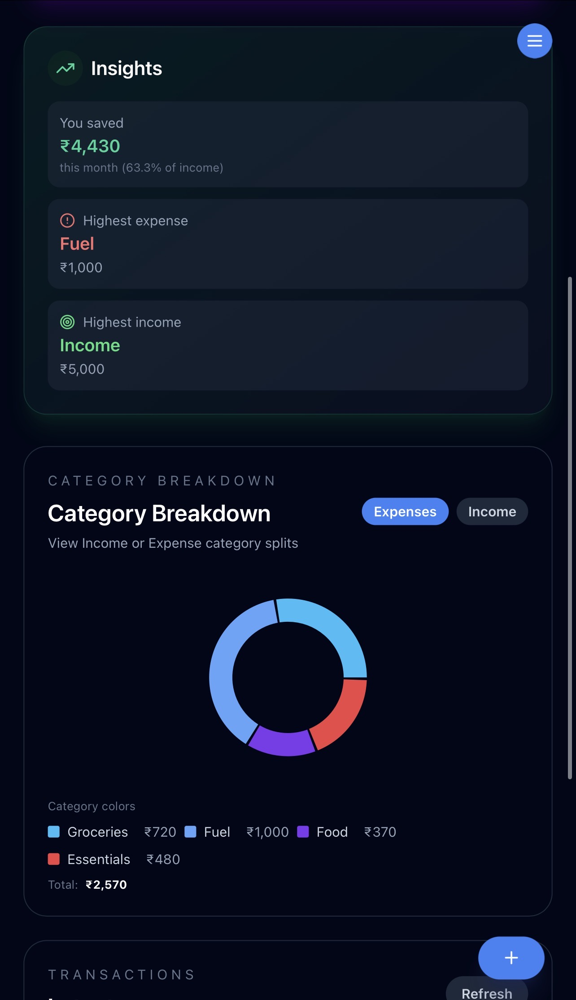
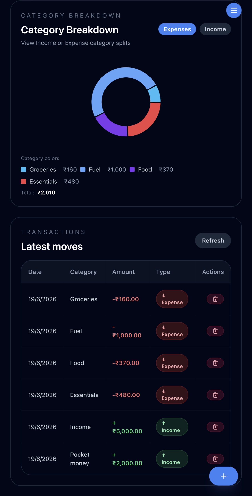

# KANAK

> Track every rupee. Master your money.

KANAK is a modern full-stack personal finance tracker built with React, TypeScript, Express, and MongoDB. It helps users manage income and expenses, visualize spending patterns, and gain better financial insights through an elegant and responsive interface.

---

## Overview

KANAK focuses on delivering a clean user experience with interactive charts, transaction management, and a fintech-inspired dashboard.

---

## Features

- Income and expense tracking
- Transaction management
- Category-wise expense analysis
- Interactive charts and visualizations
- Responsive design for desktop and mobile
- Smooth UI animations with Framer Motion
- REST API architecture
- MongoDB database integration

---

## Preview

### Demo Video

https://github.com/user-attachments/assets/f24df56a-fa5d-431e-b5fc-849d416c1d49.mov

## Screenshots

<table>
<tr>
<td align="center">


**Dashboard**

</td>

<td align="center">


**Analytics**


</td>

<td align="center">


**Transactions**


</td>

</tr>
</table>

---

## Tech Stack

### Frontend

- React
- TypeScript
- Vite
- Tailwind CSS
- Framer Motion
- Recharts
- Zustand

### Backend

- Node.js
- Express.js

### Database

- MongoDB
- Mongoose

---

## Project Structure

```text
KANAK
│
├── src/                Frontend application
├── server/             Backend API
├── static/
├── templates/
├── app.py
├── Procfile
└── README.md
```

---

## Installation

### Clone the Repository

```bash
git clone https://github.com/shaheem1771/Personal-finance-tracker.git

cd Personal-finance-tracker
```

### Install Frontend Dependencies

```bash
cd src
npm install
```

### Install Backend Dependencies

```bash
cd ../server
npm install
```

---

## Running the Application

### Start Frontend

```bash
cd src
npm run dev
```

### Start Backend

```bash
cd server
npm run dev
```

---

## Environment Variables

Create a `.env` file inside the `server` directory:

```env
MONGODB_URI=your_mongodb_connection_string
JWT_SECRET=your_secret_key
PORT=4000
```

---

## Future Improvements

- Budget planning and savings goals
- Monthly and yearly reports
- Export transactions to CSV or PDF
- Advanced analytics
- Dark mode enhancements
- Cloud deployment

---

## Author

**Muhammed Shaheem**

